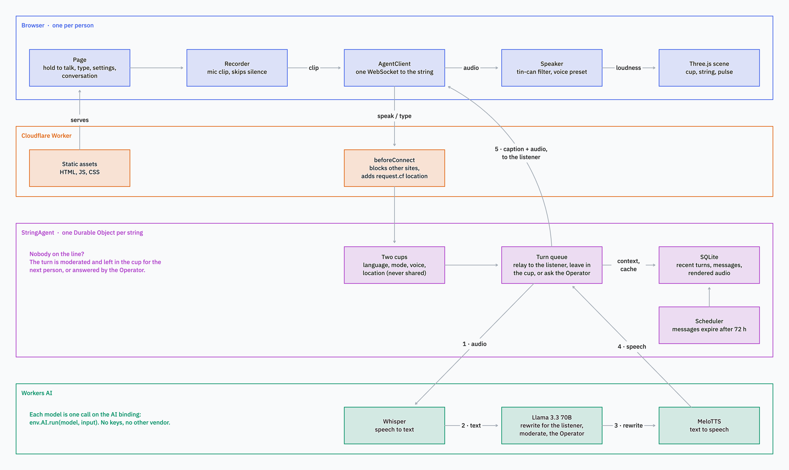
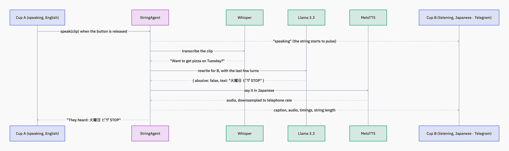

# Cupline

**A tin-can telephone for strangers.** Pick up the cup and talk. Whoever is on the other end of the string hears you in their own language, the way _they_ choose to hear you, in a voice that isn't yours.


## What it does

You hold the cup and speak, or type. Your words travel down the string, get rewritten for the person listening, and come out of their cup as speech. They pick the language and how you come across: faithfully translated, cut down to the gist, or as an old-fashioned telegram. Neither of you ever hears the other's real voice.

If nobody is on the line, you can leave a message in the cup for the next person, or talk to the Operator until someone picks up. You can also hand a friend the other cup with a link or QR code. And because the string is real, Cupline tells you how long it is: the distance between you, and how long a shout would take to cover it.

## How it works



Everything runs on Cloudflare. The page is served as static assets from a Worker. Each string is its own Durable Object, so both people on a call are connected to the same instance, which holds the conversation, the messages left in the cup, and a cache of rendered audio in SQLite.

When someone speaks, the string sends the clip through three Workers AI models: Whisper turns it into text, Llama 3.3 rewrites it for the listener (and filters out abuse in the same call), and MeloTTS turns it back into speech. Only text is ever stored. Audio is discarded once it's transcribed.

### One turn, step by step



The diagrams are drawn in tldraw; the source is [`docs/Cupline architecture.tldraw`](docs/Cupline%20architecture.tldraw).

## Built with

Cloudflare Workers · Durable Objects (Agents SDK) · Workers AI (Whisper, Llama 3.3 70B, MeloTTS) · Three.js · TypeScript

## Running it locally

You'll need Node 22+ and a Cloudflare account. Workers AI runs on Cloudflare even in local development, so it uses your account's free daily allowance.

```sh
npm install
npx wrangler login
echo "ADMIN_TOKEN=$(openssl rand -hex 16)" > .dev.vars
npm run dev
```

Open http://localhost:5173 in two browser windows and talk to yourself. `npm test`, `npm run typecheck` and `npm run lint` run the checks.

To deploy to your own account, set your domain under `routes` in `wrangler.jsonc`, then run `npx wrangler secret put ADMIN_TOKEN` and `npm run deploy`.

---

How this was built, including every prompt, is in [PROMPTS.md](PROMPTS.md).
